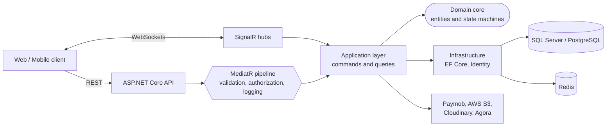
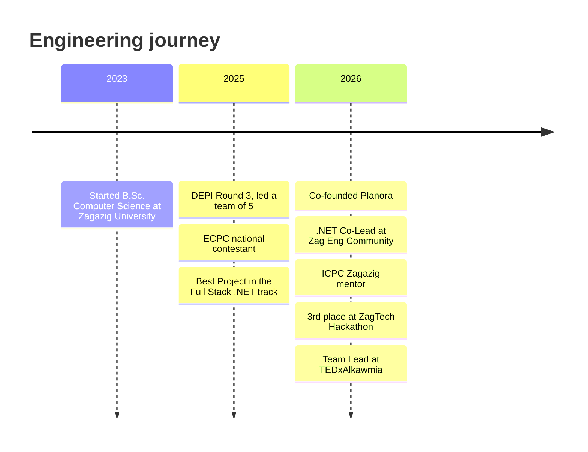

# Abdulrhman Alaa

### Backend .NET Engineer · Software Engineer

Building secure, real-time backend systems with **C#**, **ASP.NET Core**, **Clean Architecture** and **CQRS**.
Led teams of 4-5 engineers from system design to delivery. 🏆 *Best Project, Full Stack .NET track, DEPI Round 3.*

<!-- TODO: replace YOUR_CF_HANDLE with your Codeforces handle -->

---

## 👨‍💻 About me

| | |
|---|---|
| 🎓 **Education** | B.Sc. Computer Science, Zagazig University (4th year, GPA 3.2/4.0, graduating 2027) |
| 🧭 **Focus** | Backend APIs, real-time systems, payments, authentication and security |
| 👥 **Leadership** | Team Lead on 3 projects: Agile sprints, PR reviews, architecture decisions |
| 🏅 **Competitive programming** | ECPC national contestant · 400+ Codeforces problems · ICPC Zagazig mentor |
| 🌱 **Right now** | Leading the TEDxAlkawmia ticketing platform on **.NET 10** |

---

## 🛠️ Tech stack

  

| Area | Tools |
|---|---|
| **Backend** | C#, ASP.NET Core, Entity Framework Core, LINQ, SignalR, Hangfire |
| **Architecture** | Clean Architecture, CQRS, MediatR, Repository / Unit of Work, REST API design |
| **Auth & security** | JWT, refresh token rotation, OTP, Google OAuth 2.0, RBAC, rate limiting, HMAC verification |
| **Data** | SQL Server, PostgreSQL, PostGIS, Redis, EF Core migrations, concurrency control |
| **Cloud & DevOps** | AWS S3, Cloudinary, Supabase, Docker, GitHub Actions, Serilog |

---

## 🧩 How I structure backends

---

## 🚀 Featured projects

| Project | What it is | My contribution | Stack |
|---|---|---|---|
| **[Planora](https://github.com/Planora-ai-AYAIR/core)**   🟢 Deployed · [Swagger](https://planora-ai.runasp.net/swagger/index.html) <!-- TODO: confirm this live URL matches the Planora README --> | AI-powered geotechnical site intelligence (soil, flood risk, seismic, borehole planning) for land parcels across Egypt and Africa. | **Co-founder & backend engineer.** Built the multi-module analysis aggregation handler (CQRS), SignalR streaming with JWT-authenticated WebSockets, and an S3 presigned asset pipeline with Redis caching. | .NET 8, CQRS, SignalR, PostgreSQL, Redis, AWS S3 |
| **[ShurYan](https://github.com/ShurYan-Health-Care/ShurYan-Backend)**   🏆 Best Project, DEPI Round 3 · [Swagger](https://shuryan.runasp.net/swagger/index.html) | Multi-role telehealth and emergency platform for patients, doctors, pharmacies, labs and verifiers. | **Team lead (5 engineers).** Co-designed the 47-table schema and Clean Architecture foundation, integrated Paymob with HMAC-SHA512 verification, and designed the Emergency SOS pipeline. | .NET 8, SQL Server, SignalR, Agora RTC, JWT |
| **TEDxAlkawmia**   🔨 In progress · private repo | Event management and ticketing platform for a real TEDx chapter. | **Team lead (4 engineers).** Designed the Clean Architecture + CQRS solution, auth system, ticket reservation engine and CI pipeline. | .NET 10, MediatR, SQL Server, Paymob, GitHub Actions |

> 🔒 TEDxAlkawmia's code is private. I'm happy to walk through the architecture in an interview.

---

## 🧠 Problems I've solved

| Challenge | Solution | Project |
|---|---|---|
| Two buyers grabbing the last ticket at the same time | Optimistic concurrency with SQL Server `RowVersion` to prevent overselling | TEDxAlkawmia |
| Stolen refresh tokens being replayed | Stateful rotation with reuse detection and token-family revocation | TEDxAlkawmia |
| Forged payment webhooks and timing attacks | HMAC-SHA512 verification with constant-time signature comparison | ShurYan |
| EF Core `DbContext` crashes under parallel I/O | Separated database queries from `Task.WhenAll` tasks to keep thread safety | Planora |
| Broken asset links | S3 presigned URLs with pre-flight existence checks, Redis cache and on-demand invalidation | Planora |
| Medical records changing after an emergency alert | Immutable JSON clinical snapshot captured at alert time | ShurYan |
| Long-running analysis jobs with no feedback | SignalR progress streaming with a polling fallback | Planora |

---

## 🗓️ Journey

---

## 📊 GitHub analytics

  <picture>
    <source media="(prefers-color-scheme: dark)" srcset="./profile-summary-card-output/github_dark/0-profile-details.svg">
    
  </picture>
  <picture>
    <source media="(prefers-color-scheme: dark)" srcset="./profile-summary-card-output/github_dark/3-stats.svg">
    
  </picture>

  <picture>
    <source media="(prefers-color-scheme: dark)" srcset="./profile-summary-card-output/github_dark/1-repos-per-language.svg">
    
  </picture>
  <picture>
    <source media="(prefers-color-scheme: dark)" srcset="./profile-summary-card-output/github_dark/2-most-commit-language.svg">
    
  </picture>
  <picture>
    <source media="(prefers-color-scheme: dark)" srcset="./profile-summary-card-output/github_dark/4-productive-time.svg">
    
  </picture>

  <picture>
    <source media="(prefers-color-scheme: dark)" srcset="https://raw.githubusercontent.com/Abdulr7man-3laa/Abdulr7man-3laa/output/github-contribution-grid-snake-dark.svg">
    
  </picture>

---

## 🏆 Recognition & community

| | |
|---|---|
| 🥇 **Best Project, Full Stack .NET track** | DEPI Round 3 (Digital Egypt Pioneers Initiative), 2025 |
| 🥉 **3rd place, AI & Entrepreneurship track** | ZagTech Hackathon, May 2026 |
| 🏅 **National contestant** | ECPC (Egyptian Collegiate Programming Contest), Aug 2025 |
| 🎓 **.NET Co-Lead** | Zag Eng Community: structured .NET sessions for engineering students |
| 🧑‍🏫 **Competitive programming mentor** | ICPC Zagazig, teaching data structures and algorithms |

---

### 📫 Let's connect

I'm looking for **.NET backend / software engineer** opportunities.
Reach me on [LinkedIn](https://linkedin.com/in/abdulrhman-3laa) or at **abdulr7manx9@gmail.com**.

